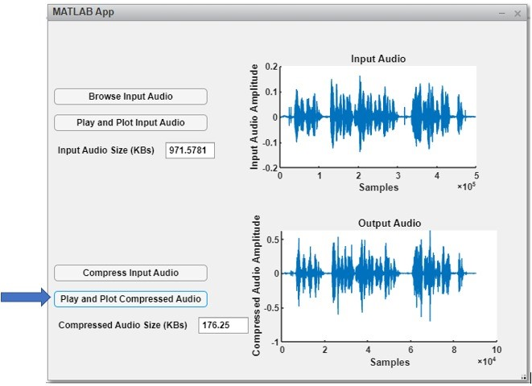

# LPC_AudioCompression
A Linear Predictive Coding Model which does audio compression as per desired order.

LPC is considered one of the most powerful speech compression techniques. This method is mostly used for representing low bit rate speech transmission or storage. This method accurately computes the speech parameters with less computation time. The main idea behind this method is that speech sample can be approximated as linear combination of past samples. In this project we implemented LPC model of order 6 and 12. It can reduce the signal size more than 1/10th of the original size. LPC is a lossy compression technique. Therefore, some data is lost while performing it. So, the signal should be compressed but the contents of the speech should be human understandable after compression was the goal.

You have to the .mlapp file to use the GUI. For giving the input click the Browse Input button. It will open a file explorer dialog box through which user can select the audio file. After Selecting the audio signal, to play and plot the input signal click the Play and Plot the Input Audio Button. You will be able to hear the audio and after the audio is played the amplitude vs sample graph will be plotted and the size of the Input Audio will be available in the box next to Input Audio Size. To compress the signal which was selected earlier click the button Compress Input Audio. This will perform LPC encoding and decoding and generate the predicted signal and save it in the current directory. In order to plot and play the predicted signal press Play and Plot compressed Audio. It will show the size of the predicted signal.

